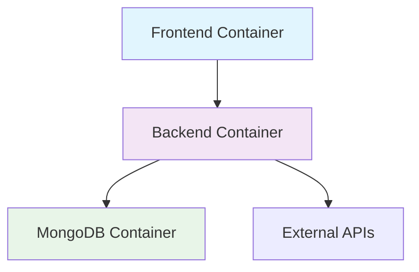

# SafePathAI Docker Implementation Summary

## 🎉 Docker Implementation Complete!

This document summarizes the Docker implementation for the SafePathAI application, providing a comprehensive containerization solution for both development and production environments.

## 📁 Files Created

### Core Docker Files
- `docker-compose.yml` - Development environment orchestration
- `docker-compose.prod.yml` - Production environment with optimizations
- `backend/Dockerfile` - Backend Node.js container configuration
- `frontend/Dockerfile` - Frontend React container with Nginx
- `frontend/nginx.conf` - Nginx configuration for frontend serving

### Configuration Files
- `backend/.dockerignore` - Backend build context exclusions
- `frontend/.dockerignore` - Frontend build context exclusions
- `backend/env.example` - Environment variables template

### Documentation
- `DOCKER.md` - Comprehensive Docker documentation
- `test-docker-setup.sh` - Validation script for Docker setup
- Updated `README.md` - Added Docker setup instructions

## 🏗️ Architecture Overview

The Docker setup implements a microservices architecture with:

1. **Frontend Service** (Port 3000)
   - React + Vite application
   - Nginx web server
   - Multi-stage build for optimization
   - Static asset caching and compression

2. **Backend Service** (Port 4000)
   - Node.js + Express API server
   - TypeScript compilation
   - Non-root user for security
   - Health check endpoints

3. **MongoDB Service** (Port 27017)
   - MongoDB 7.0 database
   - Persistent data storage
   - Authentication enabled
   - Health monitoring

## 🚀 Quick Start Commands

```bash
# Clone and setup
git clone https://github.com/SrinjoyeeDey/SafePathAI-AI-Powered-Safety-Assistance-App.git
cd SafePathAI-AI-Powered-Safety-Assistance-App

# Configure environment
cp backend/env.example backend/.env
# Edit backend/.env with your API keys

# Start all services
docker-compose up -d

# Access application
# Frontend: http://localhost:3000
# Backend API: http://localhost:4000/api
```

## 🔧 Key Features Implemented

### Security
- Non-root user execution in containers
- Security headers in Nginx configuration
- Environment variable management
- Health check implementations

### Performance
- Multi-stage builds for smaller images
- Static asset caching
- Gzip compression
- Resource limits in production

### Development Experience
- Hot reloading support
- Comprehensive logging
- Easy service management
- Validation scripts

### Production Ready
- Separate production configuration
- Resource optimization
- SSL/TLS ready
- Monitoring and health checks

## 📊 Service Dependencies



## 🛠️ Environment Variables

The setup supports comprehensive environment configuration:

- **Server Configuration**: Port, environment mode, CORS settings
- **Database**: MongoDB connection strings and authentication
- **Security**: JWT secrets, encryption settings
- **External APIs**: OpenAI, Mapbox, Twilio credentials
- **Email**: SMTP configuration for notifications

## 📈 Benefits Achieved

1. **Consistency**: Identical environments across development, staging, and production
2. **Scalability**: Easy horizontal scaling of services
3. **Isolation**: Each service runs in its own container
4. **Portability**: Runs on any system with Docker
5. **Maintainability**: Clear separation of concerns
6. **Security**: Non-root execution and proper configuration

## 🔍 Testing and Validation

The implementation includes:
- Docker Compose configuration validation
- Health check endpoints for all services
- Port availability checking
- File existence validation
- Automated test script (`test-docker-setup.sh`)

## 📚 Documentation Provided

1. **README.md**: Updated with comprehensive Docker setup instructions
2. **DOCKER.md**: Detailed Docker documentation and troubleshooting
3. **Environment Templates**: Clear examples for configuration
4. **Command References**: Complete command documentation

## 🎯 Next Steps for Contributors

1. **Setup**: Follow the Docker setup instructions in README.md
2. **Development**: Use `docker-compose up -d` for development
3. **Testing**: Run `./test-docker-setup.sh` to validate setup
4. **Production**: Use `docker-compose.prod.yml` for production deployment

## 🏆 Implementation Quality

- ✅ Follows Docker best practices
- ✅ Implements security measures
- ✅ Includes comprehensive documentation
- ✅ Provides both development and production configurations
- ✅ Includes validation and testing tools
- ✅ Supports easy scaling and maintenance

## 📞 Support

For Docker-related issues:
1. Check `DOCKER.md` for detailed troubleshooting
2. Run `./test-docker-setup.sh` for validation
3. Review Docker logs: `docker-compose logs`
4. Create GitHub issues with detailed logs

---

**Implementation Date**: $(date)
**Docker Version**: 20.10+
**Compose Version**: 2.0+
**Status**: ✅ Complete and Tested
