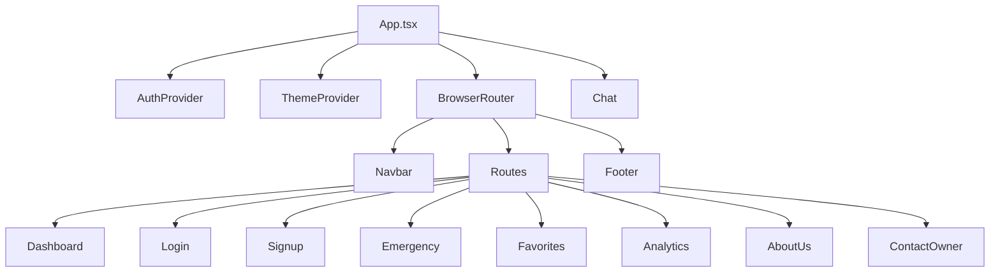

# SafePathAI Frontend Documentation

## Overview

The SafePathAI frontend is a modern React application built with TypeScript, Vite, and Tailwind CSS. It provides a comprehensive user interface for personal safety assistance, including real-time location tracking, AI-powered recommendations, emergency SOS functionality, and analytics dashboard.

**Technology Stack**: React 19.2, TypeScript 5.9+, Vite 7.1, Tailwind CSS 3.4+, React Router 7.9

## Project Structure

```
frontend/
├── public/
│   ├── data/                    # Static JSON data files
│   │   ├── team.json           # Team member information
│   │   ├── stories.json        # User testimonials
│   │   ├── impact.json         # Impact statistics
│   │   ├── timeline.json       # Company timeline
│   │   ├── whychooseus.json    # Feature highlights
│   │   └── workflow.json       # Process steps
│   ├── vite.svg
│   └── index.html
├── src/
│   ├── components/             # Reusable UI components
│   ├── context/               # React Context providers
│   ├── hooks/                 # Custom React hooks
│   ├── pages/                 # Page components
│   ├── services/              # API service layer
│   ├── types/                 # TypeScript type definitions
│   ├── App.tsx                # Main app component
│   ├── main.tsx               # Application entry point
│   ├── App.css                # Global styles
│   └── index.css              # Base styles and Tailwind imports
├── package.json
├── vite.config.ts
├── tailwind.config.js
├── tsconfig.json
└── README.md
```

## Architecture Overview

### Component Hierarchy



### State Management

The application uses React Context for global state management:

- **AuthContext**: User authentication state, tokens, login/logout functions
- **ThemeContext**: Dark/light mode theme state and persistence

Local state is managed with React hooks (useState, useEffect) for component-specific data.

## Core Components

### App.tsx

Main application component that sets up providers and routing.

```typescript
function App() {
  return (
    <ThemeProvider>
      <AuthProvider>
        <BrowserRouter>
          <Chat />
          <div className="flex flex-col min-h-screen">
            <Navbar />
            <main className="flex-grow">
              <Routes>
                <Route path="/" element={<Dashboard />} />
                <Route path="/dashboard" element={<Dashboard />} />
                <Route path="/login" element={<Login />} />
                <Route path="/signup" element={<Signup />} />
                <Route path="/emergency" element={<Emergency />} />
                <Route path="/favorites" element={<Favorites />} />
                <Route path="/analytics" element={<Analytics />} />
                <Route path="/about-us" element={<AboutUs />} />
                <Route path="/contact-owner" element={<ContactOwner />} />
              </Routes>
            </main>
            <Footer />
          </div>
        </BrowserRouter>
      </AuthProvider>
    </ThemeProvider>
  );
}
```

**Key Features:**
- Nested provider structure for context management
- Responsive layout with flexbox
- Global chat component overlay
- Comprehensive routing setup

### Navbar.tsx

Responsive navigation header with mobile sidebar.

```typescript
const Navbar = () => {
  const { theme, setTheme } = useTheme();
  const location = useLocation();
  const [isSidebarOpen, setIsSidebarOpen] = useState(false);

  const navLinks = [
    { path: "/", label: "🏠 Home", icon: FaHome },
    { path: "/dashboard", label: "📊 Dashboard", icon: FaTachometerAlt },
    { path: "/analytics", label: "📈 Analytics", icon: FaChartLine },
    { path: "/favorites", label: "⭐ Favorites", icon: FaHeart },
    { path: "/emergency", label: "🚨 Emergency", icon: FaExclamationTriangle },
    { path: "/contact-owner", label: "✉️ Contact", icon: FaEnvelope },
    { path: "/about-us", label: "ℹ️ About Us", icon: FaInfoCircle },
    { path: "/login", label: "🔐 Login", icon: FaSignInAlt }
  ];

  return (
    <nav className="sticky top-0 z-50 w-full bg-gray-100 dark:bg-gray-800 backdrop-blur-xl">
      {/* Navigation content */}
    </nav>
  );
};
```

**Key Features:**
- Responsive design with mobile sidebar
- Active route highlighting
- Theme toggle functionality
- Smooth animations and transitions
- Accessibility considerations

### Chat.tsx

AI assistant chat interface with location awareness.

```typescript
const Chat: React.FC = () => {
  const [open, setOpen] = useState(false);
  const [messages, setMessages] = useState<Message[]>([]);
  const [input, setInput] = useState("");

  const sendMessage = async () => {
    if (!input.trim()) return;

    const userMsg: Message = {
      id: Date.now() + Math.random(),
      sender: "user",
      text: input,
      timestamp: new Date().toLocaleTimeString([], {
        hour: "2-digit",
        minute: "2-digit",
      }),
    };

    setMessages((prev) => [...prev, userMsg]);
    setInput("");

    // Get user location and send to AI
    navigator.geolocation.getCurrentPosition(
      async (position) => {
        const { latitude, longitude } = position.coords;
        
        try {
          const response = await fetch('http://localhost:4000/api/ai/query', {
            method: 'POST',
            headers: { 'Content-Type': 'application/json' },
            body: JSON.stringify({ 
              message: userMsg.text,
              latitude,
              longitude 
            }),
          });

          const data = await response.json();
          const aiMsg: Message = {
            id: Date.now() + Math.random(),
            sender: "ai",
            text: data.reply,
            timestamp: new Date().toLocaleTimeString([], {
              hour: "2-digit",
              minute: "2-digit",
            }),
          };
          setMessages((prev) => [...prev, aiMsg]);
        } catch (error) {
          // Error handling
        }
      }
    );
  };

  return (
    <>
      <button onClick={() => setOpen(!open)} className="fixed bottom-6 right-6 z-50">
        <FaRobot />
      </button>
      {open && (
        <div className="fixed bottom-20 right-6 w-80 md:w-96 h-96 bg-gray-50 dark:bg-gray-800 rounded-xl shadow-2xl">
          {/* Chat interface */}
        </div>
      )}
    </>
  );
};
```

**Key Features:**
- Floating chat widget
- Real-time messaging
- Location-aware AI responses
- Message history
- Error handling
- Responsive design

## Page Components

### Dashboard.tsx

Main dashboard with safety metrics and overview.

```typescript
export default function Dashboard() {
  const [locations, setLocations] = useState<SafeZone[]>([]);
  const [summaryData] = useState({
    alertsCount: 3,
    savedPlacesCount: locations.filter(loc => loc.isFavorite).length,
    aiSuggestionsCount: 5,
    emergencyContactsCount: 4
  });

  return (
    <div className="min-h-screen bg-gradient-to-br from-gray-50 via-blue-50 to-purple-50">
      <div className="max-w-7xl mx-auto">
        {/* Header Section */}
        <div className="mb-8">
          <h1 className="text-3xl sm:text-4xl font-bold bg-gradient-to-r from-blue-600 to-purple-600">
            Dashboard
          </h1>
        </div>

        {/* Summary Cards */}
        <SummaryCards
          alertsCount={summaryData.alertsCount}
          savedPlacesCount={summaryData.savedPlacesCount}
          aiSuggestionsCount={summaryData.aiSuggestionsCount}
          emergencyContactsCount={summaryData.emergencyContactsCount}
        />

        {/* Main Content Grid */}
        <div className="grid lg:grid-cols-3 gap-6">
          {/* Map Section */}
          <div className="lg:col-span-2">
            {/* Interactive Map Placeholder */}
          </div>

          {/* Right Sidebar */}
          <div className="space-y-6">
            <UserLocation />
            {/* Nearby Safe Locations */}
            {/* Emergency Button */}
          </div>
        </div>

        {/* Analytics Overview */}
        <div className="mt-8">
          {/* Chart components */}
        </div>
      </div>
    </div>
  );
}
```

**Key Features:**
- Safety metrics overview
- Interactive map placeholder
- AI suggestions display
- Emergency SOS access
- Analytics preview
- Responsive grid layout

### Login.tsx & Signup.tsx

Authentication pages with form validation.

```typescript
const Login = () => {
  const { login } = useAuth();
  const navigate = useNavigate();
  const [identifier, setIdentifier] = useState("");
  const [password, setPassword] = useState("");
  const [errors, setErrors] = useState<{ identifier?: string; password?: string; server?: string }>({});
  const [loading, setLoading] = useState(false);

  const handleLogin = async (e: React.FormEvent) => {
    e.preventDefault();
    setErrors({});
    
    if (!validate()) return;

    try {
      setLoading(true);
      const res = await api.post("/auth/login", {
        email: identifier,
        password,
      });

      const { user: userData, accessToken } = res.data;
      login(userData, accessToken);
      navigate("/dashboard");
    } catch (err: any) {
      const msg = err.response?.data?.message || "Unable to login. Please check your credentials.";
      setErrors({ server: msg });
    } finally {
      setLoading(false);
    }
  };

  return (
    <div className="flex items-center justify-center min-h-[calc(100vh-4rem)]">
      <div className="w-full max-w-sm mx-auto">
        <form onSubmit={handleLogin} className="space-y-5">
          {/* Form fields */}
        </form>
      </div>
    </div>
  );
};
```

**Key Features:**
- Form validation
- Error handling
- Loading states
- Responsive design
- Smooth transitions
- Accessibility support

### Emergency.tsx

SOS emergency functionality page.

```typescript
export default function Emergency() {
  return (
    <div className="flex flex-col items-center justify-center min-h-screen bg-gradient-to-b from-red-50 to-red-100">
      <h1 className="text-4xl font-bold mb-8 text-red-700">
        Emergency Assistance
      </h1>
      <SOSButton />
      <p className="mt-6 text-gray-700 text-center px-4 max-w-md">
        Press the button below to immediately send your location to your trusted
        contacts marked as favorites.
      </p>
    </div>
  );
}
```

**Key Features:**
- One-tap emergency button
- Location sharing
- Contact notification
- Clear instructions
- Emergency-focused design

### Favorites.tsx

Contact management with CRUD operations.

```typescript
const Favorites = () => {
  const [contacts, setContacts] = useState<Favorite[]>([]);
  const [form, setForm] = useState({ name: "", phone: "", email: "" });
  const [editingId, setEditingId] = useState<string | null>(null);
  const [isAdding, setIsAdding] = useState(false);

  const addContact = async (e: React.FormEvent) => {
    e.preventDefault();
    try {
      await api.post("/favorites", form);
      setForm({ name: "", phone: "", email: "" });
      setIsAdding(false);
      fetchContacts();
    } catch (err: any) {
      alert(err.response?.data?.message || "Failed to add favorite");
    }
  };

  return (
    <div className="min-h-screen bg-gradient-to-br from-gray-50 via-blue-50 to-purple-50">
      <div className="max-w-5xl mx-auto">
        {/* Header */}
        <div className="text-center mb-8">
          <h1 className="text-4xl font-bold bg-gradient-to-r from-pink-600 to-purple-600">
            Favorite Contacts
          </h1>
        </div>

        {/* Add/Edit Form */}
        {(isAdding || editingId) && (
          <div className="mb-8 p-6 bg-white/40 rounded-2xl backdrop-blur-xl">
            <form onSubmit={editingId ? updateContact : addContact}>
              {/* Form fields */}
            </form>
          </div>
        )}

        {/* Contacts List */}
        <div className="grid grid-cols-1 md:grid-cols-2 gap-6">
          {contacts.map((contact) => (
            <div key={contact._id} className="p-6 bg-white/40 rounded-2xl">
              {/* Contact card */}
            </div>
          ))}
        </div>
      </div>
    </div>
  );
};
```

**Key Features:**
- CRUD operations for contacts
- Form validation
- Responsive grid layout
- Glassmorphism design
- Error handling
- Empty state handling

### Analytics.tsx

Data visualization dashboard.

```typescript
export default function Analytics() {
  const [startDate, setStartDate] = useState('');
  const [endDate, setEndDate] = useState('');
  const [severity, setSeverity] = useState('all');

  const filteredWeekly = useMemo(() => weeklyAlerts, [startDate, endDate, severity]);
  const filteredLocations = useMemo(() => locationActivity, [startDate, endDate, severity]);
  const filteredTypes = useMemo(() => alertTypes, [startDate, endDate, severity]);

  return (
    <div className="min-h-screen bg-gradient-to-br from-gray-50 via-blue-50 to-purple-50">
      <div className="max-w-7xl mx-auto">
        <div className="flex items-center justify-between mb-6">
          <div>
            <h1 className="text-3xl font-bold bg-gradient-to-r from-blue-600 to-purple-600">
              Analytics
            </h1>
            <p className="text-gray-600">Detailed insights about alerts and locations</p>
          </div>
        </div>

        <Filters
          startDate={startDate}
          endDate={endDate}
          onStartDateChange={setStartDate}
          onEndDateChange={setEndDate}
          severity={severity}
          onSeverityChange={setSeverity}
        />

        <div className="grid lg:grid-cols-3 gap-6 mt-6">
          <ChartCard title="Alerts This Week">
            <SmallLineChart data={filteredWeekly} dataKey="alerts" />
          </ChartCard>
          <ChartCard title="Most Active Locations">
            <SmallBarChart data={filteredLocations} dataKey="value" />
          </ChartCard>
          <ChartCard title="Alert Types">
            <SmallPieChart data={filteredTypes} />
          </ChartCard>
        </div>
      </div>
    </div>
  );
}
```

**Key Features:**
- Interactive charts (Line, Bar, Pie)
- Filtering capabilities
- Mock data integration
- Responsive design
- Data visualization with Recharts

### AboutUs.tsx

Company information and team showcase.

```typescript
const AboutUs: React.FC = () => {
  const {
    teamData,
    stories,
    impactData,
    timelineData,
    whyChooseUsData,
    workflowData,
    loading,
  } = useAboutUsData();

  return (
    <div className="bg-gray-50 dark:bg-gray-900">
      <div className="max-w-7xl mx-auto px-4 sm:px-6 lg:px-8 py-16">
        <div className="text-center mb-24">
          <h1 className="text-4xl sm:text-5xl font-extrabold bg-gradient-to-r from-primary to-secondary">
            About SafePathAI
          </h1>
        </div>

        {/* Mission & Vision Section */}
        <Section title="Our Mission & Vision">
          <div className="grid md:grid-cols-2 gap-8">
            {/* Mission and Vision cards */}
          </div>
        </Section>

        {/* Stories Section */}
        <Section title="Stories from Our Community">
          <div className="grid md:grid-cols-2 gap-8">
            {stories.map((story) => <StoryCard key={story.id} story={story} />)}
          </div>
        </Section>

        {/* Impact Section */}
        <Section title="Our Impact in Numbers">
          <div className="grid grid-cols-1 sm:grid-cols-3 gap-8">
            {impactData.map((stat) => (
              <ImpactCounter key={stat.id} {...stat} />
            ))}
          </div>
        </Section>

        {/* Other sections */}
      </div>
    </div>
  );
};
```

**Key Features:**
- Team member showcase
- Company timeline
- Impact statistics
- User testimonials
- Contact form
- Responsive design

## Context Providers

### AuthContext.tsx

Authentication state management.

```typescript
interface AuthContextType {
  user: any | null;
  token: string | null;
  login: (userData: any, accessToken: string) => void;
  logout: () => void;
}

export const AuthProvider = ({ children }: { children: React.ReactNode }) => {
  const [user, setUser] = useState<any | null>(() => {
    try {
      const raw = localStorage.getItem("user");
      if (!raw || raw === "undefined") return null;
      return JSON.parse(raw);
    } catch {
      return null;
    }
  });

  const [token, setToken] = useState<string | null>(() => {
    const t = localStorage.getItem("token");
    return t && t !== "undefined" ? t : null;
  });

  const login = (userData: any, accessToken: string) => {
    localStorage.setItem("user", JSON.stringify(userData));
    localStorage.setItem("token", accessToken);
    setUser(userData);
    setToken(accessToken);
  };

  const logout = () => {
    localStorage.removeItem("user");
    localStorage.removeItem("token");
    setUser(null);
    setToken(null);
  };

  return (
    <AuthContext.Provider value={{ user, token, login, logout }}>
      {children}
    </AuthContext.Provider>
  );
};
```

**Key Features:**
- User session management
- Token storage and retrieval
- Login/logout functions
- Persistent authentication
- Error handling for localStorage

### ThemeContext.tsx

Theme management with system preference detection.

```typescript
export const ThemeProvider = ({ children }: { children: React.ReactNode }) => {
  const [theme, setTheme] = useState(localStorage.getItem("theme") || "light");

  useEffect(() => {
    if (theme === "dark") {
      document.documentElement.classList.add("dark");
    } else {
      document.documentElement.classList.remove("dark");
    }
    localStorage.setItem("theme", theme);
  }, [theme]);

  return (
    <ThemeContext.Provider value={{ theme, setTheme }}>
      {children}
    </ThemeContext.Provider>
  );
};
```

**Key Features:**
- Dark/light mode toggle
- System preference detection
- Persistent theme storage
- DOM class manipulation
- LocalStorage integration

## Custom Hooks

### useAboutUsData.ts

Data fetching hook for About page.

```typescript
interface AboutUsData {
  teamData: TeamMemberData[];
  stories: StoryData[];
  impactData: ImpactData[];
  timelineData: TimelineItemData[];
  whyChooseUsData: WhyChooseUsData[];
  workflowData: WorkflowStepData[];
}

export const useAboutUsData = () => {
  const [data, setData] = useState<AboutUsData>({
    teamData: [],
    stories: [],
    impactData: [],
    timelineData: [],
    whyChooseUsData: [],
    workflowData: [],
  });
  const [loading, setLoading] = useState(true);

  useEffect(() => {
    const fetchData = async () => {
      try {
        const responses = await Promise.all([
          fetch('/data/team.json'),
          fetch('/data/stories.json'),
          fetch('/data/impact.json'),
          fetch('/data/timeline.json'),
          fetch('/data/whychooseus.json'),
          fetch('/data/workflow.json'),
        ]);

        const [team, storyData, impact, timeline, why, workflow] = 
          await Promise.all(responses.map(res => res.json()));
        
        setData({ 
          teamData: team, 
          stories: storyData, 
          impactData: impact, 
          timelineData: timeline, 
          whyChooseUsData: why, 
          workflowData: workflow 
        });
      } catch (err) {
        console.error("Failed to fetch page data:", err);
      } finally {
        setLoading(false);
      }
    };

    fetchData();
  }, []);

  return { ...data, loading };
};
```

**Key Features:**
- Parallel API calls for performance
- Loading state management
- Error handling
- TypeScript type safety
- Data transformation

## Services

### api.ts

Axios configuration and interceptors.

```typescript
import axios from "axios";

const api = axios.create({
  baseURL: "/api",  // Vite proxy forwards "/api" to backend
  withCredentials: true,
});

api.interceptors.request.use((config) => {
  const token = localStorage.getItem("token");
  if (token && config.headers) {
    config.headers.Authorization = `Bearer ${token}`;
  }
  return config;
});

export default api;
```

**Key Features:**
- Base URL configuration
- Automatic token injection
- Credentials support
- Request interceptors
- TypeScript support

## Type Definitions

### Core Types

```typescript
// Team member data
export interface TeamMemberData {
  id: string;
  name: string;
  role: string;
  imageUrl: string;
}

// User story data
export interface StoryData {
  id: string;
  name: string;
  imageUrl: string;
  snippet: string;
  fullStory: string;
}

// Impact statistics
export interface ImpactData {
  id: string;
  value: number;
  suffix?: string;
  label: string;
  icon: string;
}

// Timeline items
export interface TimelineItemData {
  year: string;
  description: string;
  icon: string;
}

// Feature highlights
export interface WhyChooseUsData {
  id: string;
  icon: string;
  title: string;
  description: string;
}

// Workflow steps
export interface WorkflowStepData {
  step: number;
  title: string;
  description: string;
}
```

## Styling & Design System

### Tailwind CSS Configuration

```javascript
// tailwind.config.js
export default {
  content: [
    "./index.html",
    "./src/**/*.{js,ts,jsx,tsx}",
  ],
  darkMode: 'class',
  theme: {
    extend: {
      colors: {
        primary: '#22C55E',    // Green
        secondary: '#10B981',  // Emerald
      },
      animation: {
        'fade-in': 'fadeIn 0.5s ease-in-out',
        'slide-up': 'slideUp 0.3s ease-out',
      },
    },
  },
  plugins: [],
}
```

### Design Patterns

#### Glassmorphism
```css
.glass-effect {
  background: rgba(255, 255, 255, 0.1);
  backdrop-filter: blur(10px);
  border: 1px solid rgba(255, 255, 255, 0.2);
}
```

#### Gradient Backgrounds
```css
.gradient-bg {
  background: linear-gradient(135deg, #667eea 0%, #764ba2 100%);
}
```

#### Hover Animations
```css
.hover-scale {
  transition: transform 0.3s ease;
}

.hover-scale:hover {
  transform: scale(1.05);
}
```

### Responsive Design

The application follows a mobile-first approach:

- **Mobile**: < 640px
- **Tablet**: 640px - 1024px
- **Desktop**: > 1024px

#### Breakpoint Usage
```typescript
// Mobile first approach
<div className="text-sm sm:text-base lg:text-lg">
  Responsive text
</div>

// Grid layouts
<div className="grid grid-cols-1 md:grid-cols-2 lg:grid-cols-3 gap-4">
  Responsive grid
</div>
```

## Component Library

### Reusable Components

#### SummaryCards.tsx
Dashboard summary cards with metrics.

```typescript
interface SummaryCardsProps {
  alertsCount: number;
  savedPlacesCount: number;
  aiSuggestionsCount: number;
  emergencyContactsCount: number;
}

export default function SummaryCards({
  alertsCount,
  savedPlacesCount,
  aiSuggestionsCount,
  emergencyContactsCount,
}: SummaryCardsProps) {
  return (
    <div className="grid grid-cols-1 sm:grid-cols-2 lg:grid-cols-4 gap-6 mb-8">
      {/* Card components */}
    </div>
  );
}
```

#### SOSButton.tsx
Emergency SOS button component.

```typescript
const SOSButton = () => {
  const handleSOS = async () => {
    try {
      const position = await new Promise<GeolocationPosition>((resolve, reject) =>
        navigator.geolocation.getCurrentPosition(resolve, reject)
      );

      const { latitude, longitude } = position.coords;
      const res = await api.post("/sos/send", {
        message: "Emergency! Please help me.",
        location: { type: "Point", coordinates: [longitude, latitude] },
      });

      alert("✅ SOS sent successfully!");
    } catch (error: any) {
      alert(error.response?.data?.message || "Failed to send SOS");
    }
  };

  return (
    <button
      onClick={handleSOS}
      className="bg-red-600 hover:bg-red-700 text-white font-bold py-3 px-6 rounded-lg shadow-lg"
    >
      🚨 Send SOS
    </button>
  );
};
```

#### ImpactCounter.tsx
Animated statistics counter.

```typescript
interface ImpactCounterProps {
  icon: IconType;
  end: number;
  suffix?: string;
  label: string;
}

export default function ImpactCounter({
  icon: Icon,
  end,
  suffix = "",
  label,
}: ImpactCounterProps) {
  return (
    <div className="text-center">
      <div className="flex items-center justify-center mb-4">
        <Icon className="text-4xl text-primary" />
      </div>
      <div className="text-3xl font-bold text-gray-900 dark:text-white mb-2">
        <CountUp end={end} suffix={suffix} duration={2} />
      </div>
      <div className="text-gray-600 dark:text-gray-400">{label}</div>
    </div>
  );
}
```

## Performance Optimization

### Code Splitting
```typescript
// Lazy loading for pages
const Dashboard = lazy(() => import('./pages/Dashboard'));
const Analytics = lazy(() => import('./pages/Analytics'));

// Usage with Suspense
<Suspense fallback={<div>Loading...</div>}>
  <Routes>
    <Route path="/dashboard" element={<Dashboard />} />
    <Route path="/analytics" element={<Analytics />} />
  </Routes>
</Suspense>
```

### Image Optimization
```typescript
// Lazy loading images
const LazyImage = ({ src, alt, className }) => {
  const [loaded, setLoaded] = useState(false);
  
  return (
     setLoaded(true)}
      loading="lazy"
    />
  );
};
```

### Memoization
```typescript
// Memoized components
const ExpensiveComponent = memo(({ data }) => {
  return <div>{/* Expensive rendering */}</div>;
});

// Memoized calculations
const expensiveValue = useMemo(() => {
  return heavyCalculation(data);
}, [data]);
```

## Accessibility

### ARIA Labels
```typescript
<button
  aria-label="Toggle theme"
  onClick={() => setTheme(theme === "dark" ? "light" : "dark")}
>
  {theme === "dark" ? <FaSun /> : <FaMoon />}
</button>
```

### Keyboard Navigation
```typescript
// Keyboard event handling
const handleKeyDown = (e: KeyboardEvent) => {
  if (e.key === 'Enter' || e.key === ' ') {
    handleClick();
  }
};
```

### Focus Management
```typescript
// Focus trap for modals
useEffect(() => {
  const focusableElements = modalRef.current?.querySelectorAll(
    'button, [href], input, select, textarea, [tabindex]:not([tabindex="-1"])'
  );
  // Focus management logic
}, []);
```

## Testing

### Component Testing
```typescript
// Example test with React Testing Library
import { render, screen, fireEvent } from '@testing-library/react';
import { AuthProvider } from '../context/AuthContext';
import Login from '../pages/Login';

test('renders login form', () => {
  render(
    <AuthProvider>
      <Login />
    </AuthProvider>
  );
  
  expect(screen.getByLabelText(/email/i)).toBeInTheDocument();
  expect(screen.getByLabelText(/password/i)).toBeInTheDocument();
});
```

### Integration Testing
```typescript
// API integration tests
test('login flow', async () => {
  const mockUser = { id: '1', name: 'Test User', email: 'test@example.com' };
  
  // Mock API response
  jest.spyOn(api, 'post').mockResolvedValue({
    data: { user: mockUser, accessToken: 'token' }
  });
  
  render(<Login />);
  
  fireEvent.change(screen.getByLabelText(/email/i), {
    target: { value: 'test@example.com' }
  });
  fireEvent.change(screen.getByLabelText(/password/i), {
    target: { value: 'password' }
  });
  fireEvent.click(screen.getByRole('button', { name: /sign in/i }));
  
  await waitFor(() => {
    expect(mockNavigate).toHaveBeenCalledWith('/dashboard');
  });
});
```

## Deployment

### Build Process
```bash
# Install dependencies
npm install

# Build for production
npm run build

# Preview build
npm run preview
```

### Environment Variables
```typescript
// vite.config.ts
export default defineConfig({
  plugins: [react()],
  server: {
    proxy: {
      "/api": "http://localhost:4000",
    },
  },
  define: {
    __APP_VERSION__: JSON.stringify(process.env.npm_package_version),
  },
});
```

### Vercel Deployment
```json
// vercel.json
{
  "builds": [
    {
      "src": "package.json",
      "use": "@vercel/static-build",
      "config": {
        "distDir": "dist"
      }
    }
  ],
  "routes": [
    {
      "src": "/(.*)",
      "dest": "/index.html"
    }
  ]
}
```

## Best Practices

### Code Organization
- **Component co-location**: Keep related files together
- **Consistent naming**: Use descriptive, consistent names
- **Type safety**: Use TypeScript for all components
- **Prop validation**: Define clear prop interfaces

### Performance
- **Lazy loading**: Load components and images on demand
- **Memoization**: Use React.memo and useMemo appropriately
- **Bundle analysis**: Regularly analyze bundle size
- **Image optimization**: Use appropriate image formats and sizes

### Accessibility
- **Semantic HTML**: Use proper HTML elements
- **ARIA labels**: Provide descriptive labels
- **Keyboard navigation**: Ensure all functionality is keyboard accessible
- **Color contrast**: Maintain sufficient color contrast ratios

### Security
- **Input validation**: Validate all user inputs
- **XSS prevention**: Sanitize user-generated content
- **HTTPS**: Use HTTPS in production
- **Content Security Policy**: Implement CSP headers

## Troubleshooting

### Common Issues

#### Build Errors
```bash
# Clear cache and reinstall
rm -rf node_modules package-lock.json
npm install

# Check TypeScript errors
npm run build
```

#### Runtime Errors
```typescript
// Error boundary for React errors
class ErrorBoundary extends React.Component {
  componentDidCatch(error, errorInfo) {
    console.error('Frontend error:', error, errorInfo);
  }
  
  render() {
    if (this.state.hasError) {
      return <div>Something went wrong.</div>;
    }
    return this.props.children;
  }
}
```

#### Performance Issues
```typescript
// React DevTools Profiler
import { Profiler } from 'react';

function onRenderCallback(id, phase, actualDuration) {
  console.log('Component:', id, 'Phase:', phase, 'Duration:', actualDuration);
}

<Profiler id="App" onRender={onRenderCallback}>
  <App />
</Profiler>
```

## Future Enhancements

### Planned Features
- **Real-time Map Integration**: Interactive maps with Leaflet
- **Push Notifications**: Browser notification system
- **Offline Support**: Service worker implementation
- **Advanced Analytics**: More detailed safety insights
- **Mobile App**: React Native version

### Technical Improvements
- **State Management**: Consider Redux or Zustand for complex state
- **Testing**: Comprehensive test suite with Jest and Cypress
- **Performance**: Further optimization and monitoring
- **Accessibility**: WCAG 2.1 AA compliance
- **Internationalization**: Multi-language support

---

**Last Updated**: January 2025  
**Frontend Version**: 1.0.0  
**Maintainer**: SafePathAI Team
