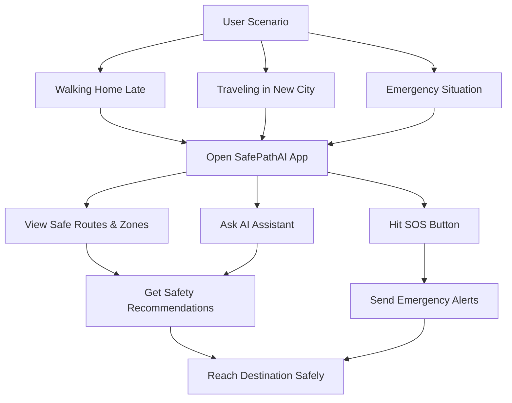
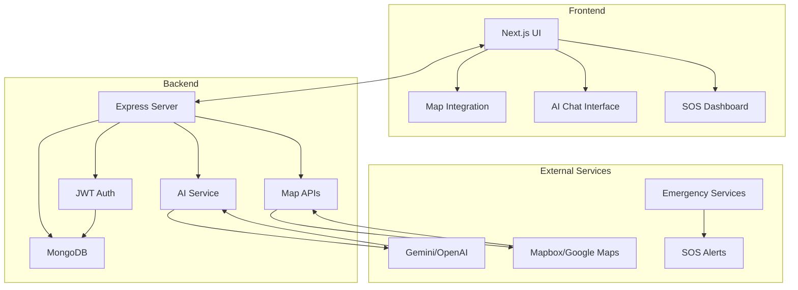
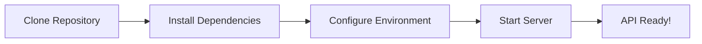
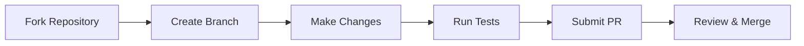

<p align="center">
  
</p>

<!-- Typing SVG Animation -->
<div align="center">
  

<br>

[](https://hacktoberfest.com)
[](https://github.com/SrinjoyeeDey/SafePathAI-AI-Powered-Safety-Assistance-App/issues)
[](https://github.com/SrinjoyeeDey/SafePathAI-AI-Powered-Safety-Assistance-App/graphs/contributors)
[](https://opensource.org/licenses/MIT)
[](https://github.com/SrinjoyeeDey/SafePathAI-AI-Powered-Safety-Assistance-App)
[](https://www.typescriptlang.org/)

**Your AI-driven personal safety assistant combining geolocation, maps, AI (Gemini/OpenAI), and the MERN stack to make urban navigation safer and smarter.**

  [Report Bug](https://github.com/SrinjoyeeDey/SafePathAI-AI-Powered-Safety-Assistance-App/issues) • [Request Feature](https://github.com/SrinjoyeeDey/SafePathAI-AI-Powered-Safety-Assistance-App/issues)

</div>

<br>

## Table of Contents
<details>

| Section | Section |
|:---|:---|
| [Features](#features) | [Quick Start](#quick-start) |
| [Use Cases](#use-cases) | [Frontend Contribution](#frontend-contribution) |
| [Tech Stack](#tech-stack) | [Contributing](#contributing) |
| [System Architecture](#system-architecture) | [Roadmap](#roadmap) |
| [Repository Structure](#repository-structure) | [Contributors](#contributors) |
</details>
<br>

## Features

<div align="left">

| Feature | Description |
|:---|:---|
| **JWT Authentication** | Secure login & signup with bcrypt password hashing |
| **Real-time Geolocation** | Live location tracking with high accuracy |
| **Nearby Safe Zones** | Find hospitals, police stations, pharmacies instantly |
| **AI Safety Assistant** | Gemini/OpenAI powered safety recommendations |
| **One-tap SOS** | Emergency alerts with live location sharing |
| **Safe Route Planning** | AI-powered safest route recommendations |
| **Cross-platform** | Responsive design for all devices |
| **Dark/Light Theme** | Accessible interface with theme toggle |

</div>

<br>

## Use Cases

<div align="center">



</div>

<div align="left">

**Real-world Scenario:**

Imagine you're walking home late at night. You open SafePathAI to:
- View nearby safe zones including hospitals and police stations
- Consult the AI assistant for the safest route recommendations
- Access instant SOS functionality that shares your live location with emergency contacts

The app provides peace of mind through real-time safety monitoring and intelligent route planning.

</div>

<br>

## Tech Stack

<div align="left">

### Backend


### Frontend (In Development)


### AI & APIs


</div>

<br>

System Architecture

<div align="center">



</div>

<br>

Repository Structure

<div align="left">
  
```typescript
SafePathAI/
├── 📂 backend/
│   ├── 📂 src/
│   │   ├── 📂 models/           # Database schemas
│   │   │   ├── User.ts          # User authentication model
│   │   │   ├── Place.ts         # Safe locations model
│   │   │   ├── SOS.ts           # Emergency alerts model
│   │   │   └── Chat.ts          # AI conversation history
│   │   ├── 📂 routes/           # API endpoints
│   │   │   ├── auth.ts          # Login/signup routes
│   │   │   ├── places.ts        # Location data routes
│   │   │   ├── ai.ts            # AI assistant routes
│   │   │   └── sos.ts           # Emergency alert routes
│   │   ├── 📂 controllers/      # Business logic
│   │   ├── 📂 middleware/       # Auth & error handling
│   │   └── index.ts             # Server entry point
│   ├── .env.example             # Environment template
│   ├── package.json
│   ├── package-lock.json
│   └── tsconfig.json
│
├── 📂 frontend/
│   ├── 📂 public/
│   │   ├── vite.svg
│   │   └── index.html
│   ├── 📂 src/
│   │   ├── 📂 components/
│   │   │   ├── 📂 Dashboard/
│   │   │   │   └── UserLocation.tsx
│   │   │   ├── Chat.tsx
│   │   │   ├── DarkModeToggle.tsx
│   │   │   ├── Footer.tsx
│   │   │   ├── Map.tsx
│   │   │   ├── Navbar.tsx
│   │   │   └── SOSButton.tsx
│   │   ├── 📂 context/
│   │   │   ├── AuthContext.tsx
│   │   │   └── ThemeContext.tsx
│   │   ├── 📂 pages/
│   │   │   ├── Dashboard.tsx
│   │   │   ├── Emergency.tsx
│   │   │   ├── Favorites.tsx
│   │   │   ├── Login.tsx
│   │   │   └── Signup.tsx
│   │   ├── 📂 services/
│   │   │   ├── api.ts
│   │   │   └── (other service files)
│   │   ├── App.css
│   │   ├── App.tsx
│   │   ├── index.css
│   │   └── main.tsx
│   ├── .gitignore
│   ├── DESIGN_GUIDE.md
│   ├── README.md
│   ├── eslint.config.js
│   ├── package.json
│   ├── package-lock.json
│   ├── postcss.config.cjs
│   ├── postcss.config.js
│   ├── tailwind.config.js
│   ├── tsconfig.app.json
│   └── tsconfig.json
│
├── .gitignore
├── LICENSE.md
├── README.md
├── package.json
└── package-lock.json
```

</div>

<br>

Quick Start

### Prerequisites

<div align="left">


</div>

Installation

<div align="left">

```bash
# 1. Clone the repository
git clone https://github.com/SrinjoyeeDey/SafePathAI-AI-Powered-Safety-Assistance-App.git
cd SafePathAI-AI-Powered-Safety-Assistance-App/backend

# 2. Install dependencies
npm install

# 3. Configure environment
cp .env.example .env
# Edit .env with your API keys

# 4. Start development server
npm run dev

# 5. Backend API running at:
# http://localhost:4000/api
```

</div>

<div align="center">



</div>

Environment Variables

<div align="left">

Create .env file in /backend:

```env
PORT=4000
MONGO_URI=your_mongodb_connection_string
JWT_ACCESS_SECRET=your_jwt_access_secret
JWT_REFRESH_SECRET=your_jwt_refresh_secret
OPENAI_API_KEY=your_openai_or_gemini_key
MAPBOX_API_KEY=your_mapbox_api_key
```

</div>

<br>

Frontend Contribution

<div align="center">


</div>

<div align="left">

### Priority Tasks
- **Mobile-responsive dashboard** with Next.js + shadcn/ui
- **Map integration** with real-time location tracking
- **AI chat interface** with message history
- **SOS emergency panel** with one-tap functionality
- **Theme system** (green/white palette with dark/light mode)

### Design Guidelines
Please follow our [Design Guide](https://github.com/SrinjoyeeDey/SafePathAI-AI-Powered-Safety-Assistance-App/blob/main/frontend/DESIGN_GUIDE.md) for:
- **Color Palette**: Green/white theme with accessibility standards
- **Typography**: Consistent font hierarchy and spacing
- **Components**: Reusable UI patterns with shadcn/ui
- **Responsive Layouts**: Mobile-first approach

### Good First Issues
Look for issues tagged with: 
`good-first-issue` `frontend` `ui` `documentation`

</div>

<br>

🤝 Contributing

<div align="center">

We love your input! We want to make contributing as easy and transparent as possible.


</div>

Development Workflow

<div align="center">



</div>

Steps to Contribute

<div align="left">

1. Fork the repository
2. Create a feature branch: git checkout -b feature/amazing-feature
3. Commit your changes: git commit -m 'Add amazing feature'
4. Push to the branch: git push origin feature/amazing-feature
5. Open a Pull Request

### Development Guidelines
- Use TypeScript for all new code
- Follow React/Next.js best practices
- Use shadcn/ui components for consistency
- Write meaningful commit messages
- Test your changes thoroughly
- Update documentation if needed


### Documentations:

## Backend Documentations:
  The Backend Documentation is generated using SwaggerUI and is available at `http://localhost:4000/api-docs`.
  Frontend developer can refer to the same to create `json` objects.

## Frontend Documentations:
The Backend Documentation is generated using Typedoc and tsdocs and can be build using
```bash
npm run docs
```
command.

The outputed static files will be available in /docs folder


</div>

<br>

## Roadmap

<div align="left">

| Feature | Description |
|---------|-------------|
| Core Backend | JWT Auth, MongoDB, Basic AI |
| Frontend Development | Next.js UI, Map Integration |
| Real-time Features | Live location sharing, notifications |
| Advanced AI | Predictive safety analytics |
| Mobile App | React Native application |
| Multi-language | Internationalization support |
| Offline Mode | Basic functionality without internet |
| Community Features | User reviews, safety tips |

</div>

<br>
<br>

## Contributors

<div align="center">

🏆 Our Amazing Contributors

<a href="https://github.com/SrinjoyeeDey/SafePathAI-AI-Powered-Safety-Assistance-App/graphs/contributors">
  
</a>

</div>

<br>

<div align="left">

### Why Contribute?

- **Learn Real-world Skills**: MERN stack + AI integration
- **Showcase Talent**: Build portfolio with modern technologies  
- **Make Impact**: Create something that enhances personal safety
- **Join Community**: Collaborate with developers worldwide
- **Recognition**: Featured in contributors section & certificates

### Get Involved

- **Discussions**: Share ideas in GitHub Discussions
- **Issues**: Report bugs or request features
- **Documentation**: Help improve docs and guides
- **Code Reviews**: Participate in peer reviews

</div>

<br>

---

<div align="center">

## Join Our Community

**Star ⭐ this repo if you find it interesting!**

**Share with friends** who might want to contribute to an impactful open-source project.

<br>


<br>

[](https://github.com/SrinjoyeeDey/SafePathAI-AI-Powered-Safety-Assistance-App/pulls)
[](https://github.com/SrinjoyeeDey/SafePathAI-AI-Powered-Safety-Assistance-App)
[](https://hacktoberfest.com)


**Built with ❤️ for the open-source community**  
**Author**: Srinjoyee Dey  
**Contributions welcome from everyone** 🙌

</div>

